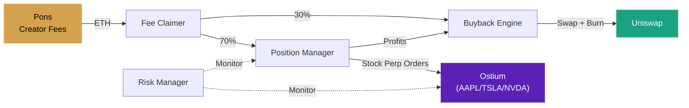

<h1 align="center">Fill Protocol</h1>

<p align="center">
  <strong>Stock-perp-backed token derivatives on Robinhood Chain</strong>
</p>

<p align="center">
  <a href="https://github.com/FillDotFun/fill/actions/workflows/ci.yml"></a>
  <a href="https://github.com/FillDotFun/fill/blob/main/LICENSE"></a>
  <a href="https://github.com/FillDotFun/fill"></a>
  <a href="https://github.com/FillDotFun/fill"></a>
  <a href="https://github.com/FillDotFun/fill"></a>
</p>

<p align="center">
  <a href="https://fill.fun">Website</a> &nbsp;&middot;&nbsp;
  <a href="#how-it-works">How It Works</a> &nbsp;&middot;&nbsp;
  <a href="#architecture">Architecture</a> &nbsp;&middot;&nbsp;
  <a href="#getting-started">Getting Started</a> &nbsp;&middot;&nbsp;
  <a href="#api">API</a> &nbsp;&middot;&nbsp;
  <a href="CONTRIBUTING.md">Contributing</a>
</p>

<br />

## Overview

Fill is a protocol that transforms memecoin creator fees into automated stock perpetual positions. Creators launch tokens on any top Robinhood Chain launchpad — [Pons](https://pons.family) (full support) or [LaunchHood](https://launchhood.com) — with the creator wallet routed to the Fill engine, which autonomously opens leveraged stock perps (AAPL, TSLA, NVDA, …) on [Ostium](https://ostium.com) — a permissionless RWA perp DEX on Arbitrum — executes buybacks via Uniswap, and manages risk. All without vaults or deposits.

<br />

## How It Works

```
  Creator launches token          Fill verifies            Engine runs
  on Pons with creator            on-chain config             autonomously
  wallet → Protocol wallet        and registers token         24/7
          |                              |                          |
          v                              v                          v
  +----------------+           +-------------------+       +-------------------+
  |     Pons       |           |   Registration    |       |  Autonomous       |
  |                |---fees--->|                   |--ok-->|  Engine           |
  |  Creator fees  |           |  Factory lookup   |       |                   |
  |  → Protocol    |           |  Creator wallet   |       |  Fee Claimer      |
  |  wallet        |           |  = Protocol?      |       |  Position Mgr     |
  +----------------+           +-------------------+       |  Buyback Engine   |
                                                           |  Risk Manager     |
                                                           +-------------------+
```

### Three Steps

| Step | Action | Detail |
|:----:|--------|--------|
| **01** | **Launch on Pons** | Deploy your token on pons.family with the Creator wallet set to the protocol wallet (Advanced → Creator wallet). |
| **02** | **Register with Fill** | Submit your token address. On-chain verification confirms creator fees route to the engine. |
| **03** | **Automated Engine** | Fees are claimed, split into stock perp positions (70%) and FILL buyback + burn (30%). Fully autonomous. |

### Fee Distribution

```
                  +------ 70% ------> Ostium Stock Perps (AAPL, TSLA, NVDA…)
                  |                   (profits → token buyback + burn)
Creator Fees -----+
                  |
                  +------ 30% ------> FILL Buyback + Burn
```

### Strategy Modes

Every token picks how the engine trades its fees (wizard step 2, or `TRADING_MODE` engine default). Existing positions are always risk-managed — modes only gate new entries.

| Mode | Leverage | Sessions | Stop |
|------|----------|----------|------|
| **Conservative** | 3-10x | US market hours only | -25% collateral |
| **Balanced** | 5-25x | Most sessions | -40% |
| **Degen** (default) | signal-driven up to 50x | 24/7 | -40% |
| **Off** | — | no trading; fees → buybacks only | — |

The leverage picked at registration is a hard cap: every trade sizes at `min(signal, strategy range, your cap)`.

<br />

## Architecture

```
fill/
├── index.html                    # Landing page (marketing)
├── launch.html                   # Launch wizard page (5 steps)
├── dashboard.html                # Live app — positions, tokens, activity
├── vite.config.js                # Vite multi-page build configuration
│
├── src/
│   ├── main.js                   # Home page entry
│   ├── launch.js                 # Launch page entry
│   ├── app.js                    # Dashboard page entry
│   │
│   ├── js/
│   │   ├── dashboard.js          # Live dashboard — search, sort, modal detail view
│   │   ├── data.js               # Data layer, stock market list, formatting utilities
│   │   ├── launcher.js           # Multi-step token registration wizard
│   │   ├── particles.js          # Canvas particle network with mouse repulsion
│   │   ├── stats.js              # Animated counter system with IntersectionObserver
│   │   ├── ticker.js             # Real-time stock ticker via backend proxy
│   │   ├── toast.js              # Non-blocking notification system
│   │   └── typewriter.js         # Cycling tagline animation
│   │
│   └── styles/                   # Design tokens, components, layout, effects
│
├── backend/
│   ├── server.js                  # Express server — CORS, rate limiting, static serving
│   ├── config.js                  # Environment variable management
│   │
│   ├── api/
│   │   ├── routes.js              # RESTful route definitions
│   │   └── controllers.js         # Request validation, response formatting
│   │
│   ├── services/
│   │   ├── ostium.js              # Ostium — stock perp trading via @ostium/builder-sdk
│   │   ├── uniswap.js             # Uniswap V3 — buyback swaps + burns on Robinhood Chain
│   │   ├── pons.js                # Pons launchpad — creator verification + fee claiming
│   │   ├── market-signal.js       # Stock signal engine (EMA/RSI/MACD/sessions)
│   │   └── chain.js               # Robinhood Chain RPC connection and wallet management
│   │
│   ├── workers/
│   │   ├── scheduler.js           # Worker lifecycle, health tracking, intervals
│   │   ├── fee-claimer.js         # Claims accumulated creator fees on-chain
│   │   ├── position-manager.js    # Opens and adjusts Ostium stock perp positions
│   │   ├── buyback-engine.js      # Executes token buybacks via Uniswap + burn
│   │   ├── risk-manager.js        # Monitors exposure, drawdowns, liquidation risk
│   │   └── token-discovery.js     # Auto-registers launches from every supported launchpad
│   │
│   ├── db/
│   │   └── firebase.js            # Firestore persistence with in-memory mock fallback
│   │
│   └── utils/
│       ├── logger.js              # Structured logging with levels and context
│       └── helpers.js             # Shared utility functions
│
├── CONTRIBUTING.md                # Development setup and code style guide
├── SECURITY.md                    # Vulnerability reporting policy
└── LICENSE                        # MIT
```

### System Flow



<br />

## Tech Stack

| Layer | Technology | Purpose |
|-------|------------|---------|
| **Frontend** | Vite, Vanilla JS, CSS Custom Properties | Landing page, dashboard, launch wizard |
| **Backend** | Node.js, Express, ethers v6 | REST API, worker orchestration |
| **Perpetuals** | Ostium (Arbitrum One, permissionless) | Stock perps up to 50x — AAPL, TSLA, NVDA, … |
| **Launchpad** | Pons (pons.family) | Token launches with creator fee routing |
| **Swaps** | Uniswap V3 on Robinhood Chain | Token buybacks and burns |
| **Database** | Firebase Firestore | Persistent state (mock fallback for dev) |
| **Blockchain** | Robinhood Chain (chainId 4663) | Settlement and on-chain verification |
| **Prices** | Yahoo Finance (proxied) | Stock candles for signals + ticker |

<br />

## Getting Started

### Prerequisites

- Node.js 20+
- npm 9+

### Frontend

```bash
npm install
npm run dev
# → http://localhost:5173
```

### Backend

```bash
cd backend
npm install
cp .env.example .env
npm start
# → http://localhost:3001
```

> **Note:** The backend runs in **mock mode** when `FIREBASE_SERVICE_ACCOUNT` is not set. All API endpoints work with an in-memory store — no external dependencies needed for development.

### Environment Variables

| Variable | Description | Default |
|----------|-------------|---------|
| `PORT` | Backend server port | `3001` |
| `ROBINHOOD_RPC_URL` | Robinhood Chain RPC endpoint | Public mainnet |
| `PROTOCOL_PRIVATE_KEY` | 0x-prefixed EVM signing key | Required for production |
| `PROTOCOL_ADDRESS` | Protocol fee recipient | Derived from key |
| `PONS_FACTORY` / `PONS_LOCKER` | Pons launchpad contracts | Built-in mainnet |
| `ARBITRUM_RPC_URL` | Arbitrum RPC for Ostium trading | Public mainnet |
| `UNISWAP_ROUTER` | Uniswap V3 SwapRouter02 on Robinhood Chain | Required for buybacks |
| `FIREBASE_SERVICE_ACCOUNT` | Path to Firebase credentials | Mock mode |

<br />

## API

All endpoints are prefixed with `/api/v1`. Responses are JSON.

### Tokens

| Method | Endpoint | Description |
|--------|----------|-------------|
| `GET` | `/tokens` | List all registered derivatives |
| `GET` | `/tokens/:address` | Get token by address |
| `POST` | `/tokens/register` | Register new derivative (on-chain verification) |

### Positions & Buybacks

| Method | Endpoint | Description |
|--------|----------|-------------|
| `GET` | `/positions` | List all open stock perp positions |
| `GET` | `/positions/live` | Live Ostium positions with unrealised PnL |
| `GET` | `/positions/:address` | Get position for a specific token |
| `GET` | `/buybacks` | List all executed buybacks |
| `GET` | `/buybacks/:address` | Get buybacks for a specific token |

### System

| Method | Endpoint | Description |
|--------|----------|-------------|
| `GET` | `/health` | Server health and uptime |
| `GET` | `/stats` | Protocol-wide aggregate statistics |
| `GET` | `/status` | Full engine status with worker health |
| `GET` | `/runs` | List all worker execution runs |
| `GET` | `/markets` | Available Ostium stock perp markets |
| `GET` | `/ticker` | Stock quotes for the frontend ticker |

### Example

```bash
# Register a new derivative pegged to AAPL
curl -X POST http://localhost:3001/api/v1/tokens/register \
  -H "Content-Type: application/json" \
  -d '{"address": "0x95AcdC578D662546E748C9ff2cc53267cDDBeF03", "underlying": "AAPL"}'

# Check engine status
curl http://localhost:3001/api/v1/status
```

<br />

## Workers

The engine runs five autonomous workers in staggered intervals. Each worker independently handles its domain and reports health to the scheduler.

| Worker | Interval | Responsibility |
|--------|----------|----------------|
| **Fee Claimer** | 3-5 min | Claims accumulated creator fees from all registered Pons tokens |
| **Position Manager** | 5-8 min | Opens or adjusts Ostium stock perp positions based on claimed fees |
| **Buyback Engine** | 15-30 min | Swaps allocated ETH for derivative tokens via Uniswap and burns |
| **Risk Manager** | 5-10 min | Monitors position exposure, drawdowns, and liquidation proximity |
| **Token Discovery** | 5-10 min | Auto-registers launches from all supported launchpads pointing at the protocol wallet |

```
Timeline (one cycle):

0m     Fee Claimer starts
       ├── Iterate registered tokens
       ├── Claim fees from Pons (locker + factory)
       └── Record to Firestore

5m     Position Manager starts
       ├── Read unclaimed fee pool
       ├── Check stock signals (EMA/RSI/MACD/session)
       └── Submit positions on Ostium

15m    Buyback Engine starts
       ├── Allocate buyback budget
       ├── Execute Uniswap swaps
       └── Burn acquired tokens

Every 60-90s: fast profit-checker (SL / TP / trailing stop)
```

<br />

## Testing

```bash
cd backend
npm test              # 34 tests: config, helpers, strategies, API integration
npm run verify:ostium # live check: mainnet + testnet pairs, unsigned trade build
```

The API tests boot the real server in mock mode and exercise every endpoint,
including a live on-chain registration rejection against Robinhood Chain.

## Going Live — Funding Checklist

The protocol wallet address works on both chains. Before real money flows:

1. **USDC on Arbitrum One** — trading collateral for Ostium (engine caps at `MAX_TRADING_CAPITAL_USD`, default $1,500)
2. **A little ETH on Arbitrum One** — gas for the one-time USDC approval and each trade
3. **A little ETH on Robinhood Chain** — gas for fee claims and buybacks
4. Back up `PROTOCOL_PRIVATE_KEY` — the gitignored `.env` is the only copy

## Contributing

See [CONTRIBUTING.md](CONTRIBUTING.md) for development setup and guidelines.

## Security

See [SECURITY.md](SECURITY.md) for vulnerability reporting.

## License

MIT — see [LICENSE](LICENSE) for details.
